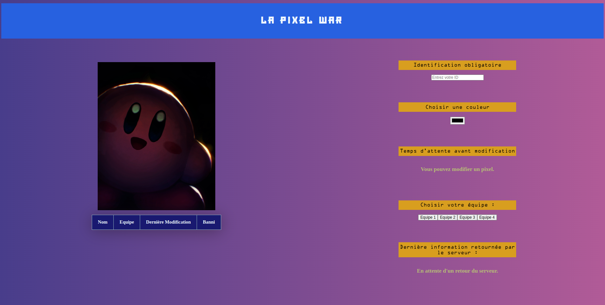

# LA PIXEL WAR

1. [Description](#Description)
2. [Visuel](#Visuel)
3. [Que m'a apporté la réalisation du site ?](#compAcquises)
4. [Mes ajouts personnels](#ajoutsPersos)
5. [Les ajouts potentiels](#ajoutsPotentiels)
6. [Auteur](#auteur)

## Description 
Ce projet est une Pixel War (autrement dit "Guerre des pixels"). Il affiche un tableau de pixels que vous (et tout ceux qui ont accès à ce tableau) pouvez modifier pixel par pixel si vous réunissez les conditions nécessaires (affiché sur la partie gauche de la fenetre principale du site). Vous pouvez modifier la couleur de votre pixel et le poser tant que vous avez un UID et que vous sélectionnez un groupe.  

Vous pouvez retrouver le site en cliquant [ici](http://127.0.0.1:3000/pixel_war.html).  

## Visuel 
Ci-dessous la fenetre principale du site web.

## Que m'a apporté la réalisation du site ? 
En réalisant ce site j'ai renforcé mes compétences en html et en css et découvert et acquis de nouvelles compétences en javascript. C'est grâce à ce langage que j'ai notamment appris à faire des requêtes asyncrones, à utiliser les méthodes GET et PUT, à récupérer et comprendre les codes d'erreurs, et à modifier un fichier json. 

## Mes ajouts personnels 
Afin de personaliser ce projet, j'ai décidé d'apporter différents ajouts à ce qui était demandé.  
J'ai légèrement stylisé le site en ajoutant un dégradé pour colorer le fond, inversé les couleurs de certains éléments par rapport au fond pour les rendre plus visible, et apporté des couleurs et des ombres au tableau de la liste des joueurs.
J'ai rendu le site responsive pour qu'il soit lisible peu importe la taille de ma fenêtre.
J'ai aussi ajouté une fonction en javascript qui affiche une image aléatoire (de Kirby) lorsque le site lors de l'affichage du site. 
Enfin, j'ai fais en sorte de rendre l'UID visible ou non afin de le garder confidentiel.

## Les ajouts potentiels 
Afin d'améliorer le site, nous pourrions notamment ajouter des tableaux de pixels différents selon les équipes.

## Auteur 
Moi, Marchandise Tim, étudiant en BUT1 au département informatique de l'Université de Bordeaux, atteste que ce projet est le fruit de mon travail. 

[`Retour au sommaire`](#sommaire)